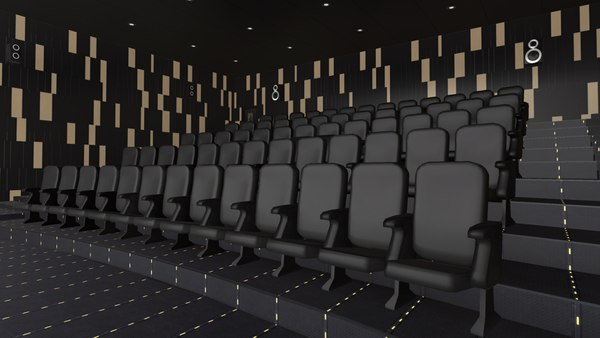

# Cinema-app

This application is implemented as a ticket service for cinemas.
It allows to create cinema sessions,
add new movies, cinema halls and check what the session is available,
buy tickets and check previous orders. 
This project has a simple authentication system based on Hibernate and Spring.
- --

### Endpoints
- Available endpoints in the project:*
- POST: /register - all 
- GET: /cinema-halls - user/admin 
- POST: /cinema-halls - admin
- GET: /movies - user/admin
- POST: /movies - admin
- GET: /movie-sessions/available - user/admin
- POST: /movie-sessions - admin
- PUT: /movie-sessions/{id} - admin
- DELETE: /movie-sessions/{id} - admin
- GET: /orders - user
- POST: /orders/complete - user
- PUT: /shopping-carts/movie-sessions - user
- GET: /shopping-carts/by-user - user
- GET: /users/by-email - admin
- --

### The structure of this project consists of 3 levels:
* Data access layer (DAO). This layer is responsible for accessing the database. It is implemented with Hibernate API.
* Application layer (service). This layer implements the main logic of the application.
* Presentation layer (controllers). This layer is responsible for communication with a user. It is implemented with Spring API
- --

### Used technologies
- Java 11
- Apache Tomcat 
- Hibernate
- Spring (Web, Security, Core)
- MySql
- Lombok 
- Maven checkstyle plugin
- --

### How to run program
1. Install and configure Apache Tomcat
2. Install and configure and create a schema in MySQL
3. Fork and clone this project
4. In the /resources/db.properties file, replace the stubs with your database data
5. Run the application
6. After running the application you will be redirected to login page. You can use:
    * username `admin@i.ua` and password `admin123` for login as admin
    * username `user@i.ua` and password `user123` for login as user
7. Use Postman for sending your requests during testing this application
